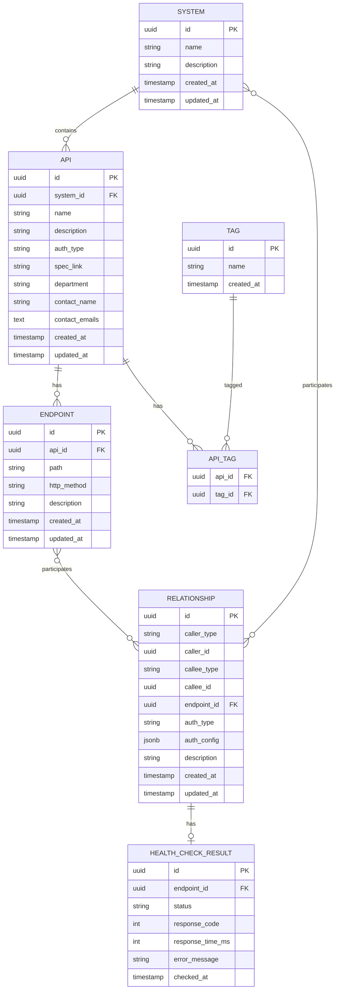

# 设计文档

## 概述

API管理系统是一个基于Java云原生框架的微服务应用，部署在AWS Lambda上，使用PostgreSQL作为数据存储。系统提供RESTful API用于管理API元数据、调用关系，并支持拓扑图可视化和健康检查功能。

### 技术栈

- **运行时**: AWS Lambda (Java 17+)
- **框架**: Quarkus (云原生Java框架，优化Lambda冷启动)
- **数据库**: Amazon RDS PostgreSQL
- **API文档**: OpenAPI 3.0
- **构建工具**: Maven
- **数据访问**: Quarkus Reactive PostgreSQL Client (io.vertx:vertx-pg-client)

## 架构

### 整体架构

系统采用分层架构设计：

```
┌─────────────────────────────────────┐
│         API Gateway (REST)          │
│      (AWS API Gateway + Lambda)     │
└─────────────────────────────────────┘
                 │
┌─────────────────────────────────────┐
│        Controller Layer             │
│  - ApiController                    │
│  - SystemController                 │
│  - RelationshipController           │
│  - HealthCheckController            │
│  - TopologyController               │
└─────────────────────────────────────┘
                 │
┌─────────────────────────────────────┐
│         Service Layer               │
│  - ApiService                       │
│  - SystemService                    │
│  - RelationshipService              │
│  - HealthCheckService               │
│  - TopologyService                  │
└─────────────────────────────────────┘
                 │
┌─────────────────────────────────────┐
│       Repository Layer              │
│  - ApiRepository                    │
│  - SystemRepository                 │
│  - RelationshipRepository           │
│  - TagRepository                    │
└─────────────────────────────────────┘
                 │
┌─────────────────────────────────────┐
│      PostgreSQL Database            │
│         (Amazon RDS)                │
└─────────────────────────────────────┘
```

### Lambda部署架构

- 使用AWS Lambda函数URL或API Gateway作为入口
- Quarkus原生镜像编译以减少冷启动时间
- 使用RDS Proxy连接PostgreSQL以优化数据库连接管理
- 环境变量配置数据库连接信息

## 组件和接口

### 1. Controller层

#### ApiController
负责API实体的CRUD操作

**端点**:
- `POST /api/v1/apis` - 创建API
- `GET /api/v1/apis/{id}` - 获取API详情
- `PUT /api/v1/apis/{id}` - 更新API
- `DELETE /api/v1/apis/{id}` - 删除API
- `GET /api/v1/apis` - 查询API列表（支持标签筛选）
- `GET /api/v1/apis/search` - 按系统搜索API

#### EndpointController
负责Endpoint的CRUD操作

**端点**:
- `POST /api/v1/endpoints` - 创建Endpoint
- `GET /api/v1/endpoints/{id}` - 获取Endpoint详情
- `PUT /api/v1/endpoints/{id}` - 更新Endpoint
- `DELETE /api/v1/endpoints/{id}` - 删除Endpoint
- `GET /api/v1/endpoints` - 查询Endpoint列表
- `GET /api/v1/apis/{apiId}/endpoints` - 获取指定API的所有Endpoint

#### SystemController
负责系统的CRUD操作

**端点**:
- `POST /api/v1/systems` - 创建系统
- `GET /api/v1/systems/{id}` - 获取系统详情
- `PUT /api/v1/systems/{id}` - 更新系统
- `DELETE /api/v1/systems/{id}` - 删除系统
- `GET /api/v1/systems` - 查询系统列表

#### RelationshipController
负责调用关系的管理

**端点**:
- `POST /api/v1/relationships` - 创建调用关系
- `GET /api/v1/relationships/{id}` - 获取调用关系详情
- `PUT /api/v1/relationships/{id}` - 更新调用关系
- `DELETE /api/v1/relationships/{id}` - 删除调用关系
- `GET /api/v1/relationships` - 查询调用关系列表

#### HealthCheckController
负责API健康检查

**端点**:
- `POST /api/v1/health-check/batch` - 批量健康检查
- `POST /api/v1/health-check/system/{systemId}` - 按系统健康检查
- `GET /api/v1/health-check/results/{batchId}` - 获取健康检查结果

#### TopologyController
负责拓扑图数据

**端点**:
- `GET /api/v1/topology` - 获取完整拓扑图数据
- `GET /api/v1/topology/filter` - 获取筛选后的拓扑图数据

#### OpenApiController
提供OpenAPI规格文档

**端点**:
- `GET /api/v1/openapi.json` - 获取OpenAPI 3.0规格文档

### 2. Service层

#### ApiService
- 业务逻辑：API实体的创建、更新、删除、查询
- 标签管理
- 邮箱格式验证

#### SystemService
- 业务逻辑：系统的创建、更新、删除、查询
- 系统关联的API查询

#### RelationshipService
- 业务逻辑：调用关系的创建、更新、删除、查询
- 验证调用方和被调用方的存在性
- 支持多态关系（系统或API）

#### HealthCheckService
- 执行HTTP健康检查请求
- 异步批量检查
- 结果聚合和存储

#### TopologyService
- 构建拓扑图数据结构
- 节点和边的计算
- 筛选逻辑

### 3. Repository层

使用Quarkus Reactive PostgreSQL Client进行数据访问

#### ApiRepository
```java
@ApplicationScoped
public class ApiRepository {
    @Inject
    PgPool client;
    
    public Uni<ApiEntity> create(ApiEntity api);
    public Uni<ApiEntity> findById(UUID id);
    public Uni<List<ApiEntity>> findAll();
    public Uni<List<ApiEntity>> findBySystemId(UUID systemId);
    public Uni<List<ApiEntity>> findByTags(Set<String> tags);
    public Uni<ApiEntity> update(ApiEntity api);
    public Uni<Boolean> delete(UUID id);
}
```

#### EndpointRepository
```java
@ApplicationScoped
public class EndpointRepository {
    @Inject
    PgPool client;
    
    public Uni<EndpointEntity> create(EndpointEntity endpoint);
    public Uni<EndpointEntity> findById(UUID id);
    public Uni<List<EndpointEntity>> findByApiId(UUID apiId);
    public Uni<List<EndpointEntity>> findAll();
    public Uni<EndpointEntity> update(EndpointEntity endpoint);
    public Uni<Boolean> delete(UUID id);
}
```

#### SystemRepository
```java
@ApplicationScoped
public class SystemRepository {
    @Inject
    PgPool client;
    
    public Uni<SystemEntity> create(SystemEntity system);
    public Uni<SystemEntity> findById(UUID id);
    public Uni<SystemEntity> findByName(String name);
    public Uni<List<SystemEntity>> findAll();
    public Uni<SystemEntity> update(SystemEntity system);
    public Uni<Boolean> delete(UUID id);
}
```

#### RelationshipRepository
```java
@ApplicationScoped
public class RelationshipRepository {
    @Inject
    PgPool client;
    
    public Uni<RelationshipEntity> create(RelationshipEntity relationship);
    public Uni<RelationshipEntity> findById(UUID id);
    public Uni<List<RelationshipEntity>> findAll();
    public Uni<List<RelationshipEntity>> findByCaller(EntityType type, UUID id);
    public Uni<List<RelationshipEntity>> findByCallee(EntityType type, UUID id);
    public Uni<RelationshipEntity> update(RelationshipEntity relationship);
    public Uni<Boolean> delete(UUID id);
}
```

#### TagRepository
```java
@ApplicationScoped
public class TagRepository {
    @Inject
    PgPool client;
    
    public Uni<TagEntity> create(String name);
    public Uni<TagEntity> findByName(String name);
    public Uni<List<TagEntity>> findAll();
    public Uni<Boolean> delete(UUID id);
}
```

#### Repository实现示例

```java
@ApplicationScoped
public class SystemRepository {
    @Inject
    PgPool client;
    
    public Uni<SystemEntity> create(SystemEntity system) {
        return client.preparedQuery(
            "INSERT INTO systems (id, name, description, created_at, updated_at) " +
            "VALUES ($1, $2, $3, $4, $5) RETURNING *")
            .execute(Tuple.of(
                system.id,
                system.name,
                system.description,
                system.createdAt,
                system.updatedAt
            ))
            .onItem().transform(rows -> mapToSystemEntity(rows.iterator().next()));
    }
    
    public Uni<SystemEntity> findById(UUID id) {
        return client.preparedQuery("SELECT * FROM systems WHERE id = $1")
            .execute(Tuple.of(id))
            .onItem().transform(rows -> {
                RowIterator<Row> iterator = rows.iterator();
                return iterator.hasNext() ? mapToSystemEntity(iterator.next()) : null;
            });
    }
    
    private SystemEntity mapToSystemEntity(Row row) {
        SystemEntity entity = new SystemEntity();
        entity.id = row.getUUID("id");
        entity.name = row.getString("name");
        entity.description = row.getString("description");
        entity.createdAt = row.getLocalDateTime("created_at");
        entity.updatedAt = row.getLocalDateTime("updated_at");
        return entity;
    }
}
```

## 数据模型

### 实体关系图



### 数据库表结构

#### systems表
```sql
CREATE TABLE systems (
    id UUID PRIMARY KEY DEFAULT gen_random_uuid(),
    name VARCHAR(255) NOT NULL UNIQUE,
    description TEXT,
    created_at TIMESTAMP NOT NULL DEFAULT CURRENT_TIMESTAMP,
    updated_at TIMESTAMP NOT NULL DEFAULT CURRENT_TIMESTAMP
);

CREATE INDEX idx_systems_name ON systems(name);
```

#### apis表
```sql
CREATE TABLE apis (
    id UUID PRIMARY KEY DEFAULT gen_random_uuid(),
    system_id UUID NOT NULL REFERENCES systems(id) ON DELETE CASCADE,
    name VARCHAR(255) NOT NULL,
    description TEXT,
    auth_type VARCHAR(50),
    spec_link VARCHAR(1000),
    department VARCHAR(255),
    contact_name VARCHAR(255),
    contact_emails TEXT, -- 逗号分隔的邮箱列表
    created_at TIMESTAMP NOT NULL DEFAULT CURRENT_TIMESTAMP,
    updated_at TIMESTAMP NOT NULL DEFAULT CURRENT_TIMESTAMP,
    CONSTRAINT chk_auth_type CHECK (auth_type IN ('API_KEY', 'OAUTH2', 'BASIC_AUTH', 'JWT', 'NONE'))
);

CREATE INDEX idx_apis_system_id ON apis(system_id);
CREATE INDEX idx_apis_name ON apis(name);
```

#### endpoints表
```sql
CREATE TABLE endpoints (
    id UUID PRIMARY KEY DEFAULT gen_random_uuid(),
    api_id UUID NOT NULL REFERENCES apis(id) ON DELETE CASCADE,
    path VARCHAR(1000) NOT NULL,
    http_method VARCHAR(10) NOT NULL,
    description TEXT,
    created_at TIMESTAMP NOT NULL DEFAULT CURRENT_TIMESTAMP,
    updated_at TIMESTAMP NOT NULL DEFAULT CURRENT_TIMESTAMP,
    CONSTRAINT chk_http_method CHECK (http_method IN ('GET', 'POST', 'PUT', 'DELETE', 'PATCH', 'HEAD', 'OPTIONS')),
    UNIQUE (api_id, path, http_method)
);

CREATE INDEX idx_endpoints_api_id ON endpoints(api_id);
CREATE INDEX idx_endpoints_path ON endpoints(path);
```

#### tags表
```sql
CREATE TABLE tags (
    id UUID PRIMARY KEY DEFAULT gen_random_uuid(),
    name VARCHAR(100) NOT NULL UNIQUE,
    created_at TIMESTAMP NOT NULL DEFAULT CURRENT_TIMESTAMP
);

CREATE INDEX idx_tags_name ON tags(name);
```

#### api_tags表
```sql
CREATE TABLE api_tags (
    api_id UUID NOT NULL REFERENCES apis(id) ON DELETE CASCADE,
    tag_id UUID NOT NULL REFERENCES tags(id) ON DELETE CASCADE,
    PRIMARY KEY (api_id, tag_id)
);

CREATE INDEX idx_api_tags_tag_id ON api_tags(tag_id);
```

#### relationships表
```sql
CREATE TABLE relationships (
    id UUID PRIMARY KEY DEFAULT gen_random_uuid(),
    caller_type VARCHAR(10) NOT NULL,
    caller_id UUID NOT NULL,
    callee_type VARCHAR(10) NOT NULL,
    callee_id UUID NOT NULL,
    endpoint_id UUID NOT NULL REFERENCES endpoints(id) ON DELETE CASCADE,
    auth_type VARCHAR(50),
    auth_config JSONB,
    description TEXT,
    created_at TIMESTAMP NOT NULL DEFAULT CURRENT_TIMESTAMP,
    updated_at TIMESTAMP NOT NULL DEFAULT CURRENT_TIMESTAMP,
    CONSTRAINT chk_caller_type CHECK (caller_type IN ('SYSTEM', 'API')),
    CONSTRAINT chk_callee_type CHECK (callee_type IN ('SYSTEM', 'API')),
    CONSTRAINT chk_relationship_auth_type CHECK (auth_type IN ('API_KEY', 'OAUTH2', 'BASIC_AUTH', 'JWT', 'NONE'))
);

CREATE INDEX idx_relationships_caller ON relationships(caller_type, caller_id);
CREATE INDEX idx_relationships_callee ON relationships(callee_type, callee_id);
CREATE INDEX idx_relationships_endpoint ON relationships(endpoint_id);
```

#### health_check_results表
```sql
CREATE TABLE health_check_results (
    id UUID PRIMARY KEY DEFAULT gen_random_uuid(),
    endpoint_id UUID NOT NULL REFERENCES endpoints(id) ON DELETE CASCADE,
    status VARCHAR(20) NOT NULL,
    response_code INT,
    response_time_ms INT,
    error_message TEXT,
    checked_at TIMESTAMP NOT NULL DEFAULT CURRENT_TIMESTAMP,
    CONSTRAINT chk_status CHECK (status IN ('SUCCESS', 'FAILURE', 'TIMEOUT'))
);

CREATE INDEX idx_health_check_results_endpoint_id ON health_check_results(endpoint_id);
CREATE INDEX idx_health_check_results_checked_at ON health_check_results(checked_at DESC);
```

### Java实体类（POJO）

#### SystemEntity
```java
public class SystemEntity {
    public UUID id;
    public String name;
    public String description;
    public LocalDateTime createdAt;
    public LocalDateTime updatedAt;
    
    // Constructor, getters, setters
}
```

#### ApiEntity
```java
public class ApiEntity {
    public UUID id;
    public UUID systemId;
    public String name;
    public String description;
    public AuthType authType;
    public String specLink;
    public String department;
    public String contactName;
    public String contactEmails; // 逗号分隔的邮箱列表
    public LocalDateTime createdAt;
    public LocalDateTime updatedAt;
    public Set<String> tags; // Tag names
    
    // Constructor, getters, setters
    
    // Helper methods
    public List<String> getContactEmailList() {
        if (contactEmails == null || contactEmails.isEmpty()) {
            return Collections.emptyList();
        }
        return Arrays.stream(contactEmails.split(","))
            .map(String::trim)
            .filter(s -> !s.isEmpty())
            .collect(Collectors.toList());
    }
    
    public void setContactEmailList(List<String> emails) {
        this.contactEmails = emails == null ? null : String.join(",", emails);
    }
}
```

#### EndpointEntity
```java
public class EndpointEntity {
    public UUID id;
    public UUID apiId;
    public String path;
    public HttpMethod httpMethod;
    public String description;
    public LocalDateTime createdAt;
    public LocalDateTime updatedAt;
    
    // Constructor, getters, setters
}
```

#### RelationshipEntity
```java
public class RelationshipEntity {
    public UUID id;
    public EntityType callerType;
    public UUID callerId;
    public EntityType calleeType;
    public UUID calleeId;
    public UUID endpointId; // 具体调用的endpoint
    public AuthType authType;
    public JsonObject authConfig; // Vert.x JsonObject for JSONB
    public String description; // 调用关系的描述信息
    public LocalDateTime createdAt;
    public LocalDateTime updatedAt;
    
    // Constructor, getters, setters
}
```

#### TagEntity
```java
public class TagEntity {
    public UUID id;
    public String name;
    public LocalDateTime createdAt;
    
    // Constructor, getters, setters
}
```

#### HealthCheckResultEntity
```java
public class HealthCheckResultEntity {
    public UUID id;
    public UUID endpointId;
    public HealthCheckStatus status;
    public Integer responseCode;
    public Integer responseTimeMs;
    public String errorMessage;
    public LocalDateTime checkedAt;
    
    // Constructor, getters, setters
}
```

### 枚举类型

```java
public enum HttpMethod {
    GET, POST, PUT, DELETE, PATCH, HEAD, OPTIONS
}

public enum AuthType {
    API_KEY, OAUTH2, BASIC_AUTH, JWT, NONE
}

public enum EntityType {
    SYSTEM, API
}

public enum HealthCheckStatus {
    SUCCESS, FAILURE, TIMEOUT
}
```

## API规格 (OpenAPI 3.0)

### 核心DTO定义

#### ApiDTO
```java
public class ApiDTO {
    public UUID id;
    public UUID systemId;
    public String systemName;
    public String name;
    public String description;
    public AuthType authType;
    public String specLink;
    public String department;
    public String contactName;
    public List<String> contactEmails; // 邮箱列表
    public Set<String> tags;
    public List<EndpointDTO> endpoints;
    public LocalDateTime createdAt;
    public LocalDateTime updatedAt;
}
```

#### CreateApiRequest
```java
public class CreateApiRequest {
    @NotNull
    public UUID systemId;
    
    @NotBlank
    @Size(max = 255)
    public String name;
    
    @Size(max = 2000)
    public String description;
    
    public AuthType authType;
    
    @Size(max = 1000)
    public String specLink;
    
    @Size(max = 255)
    public String department;
    
    @Size(max = 255)
    public String contactName;
    
    @NotNull
    public List<@Email String> contactEmails; // 邮箱列表，每个邮箱都需要验证格式
    
    public Set<String> tags;
}
```

#### EndpointDTO
```java
public class EndpointDTO {
    public UUID id;
    public UUID apiId;
    public String path;
    public HttpMethod httpMethod;
    public String description;
    public LocalDateTime createdAt;
    public LocalDateTime updatedAt;
}
```

#### CreateEndpointRequest
```java
public class CreateEndpointRequest {
    @NotNull
    public UUID apiId;
    
    @NotBlank
    @Size(max = 1000)
    public String path;
    
    @NotNull
    public HttpMethod httpMethod;
    
    @Size(max = 2000)
    public String description;
}
```

#### RelationshipDTO
```java
public class RelationshipDTO {
    public UUID id;
    public EntityType callerType;
    public UUID callerId;
    public String callerName;
    public EntityType calleeType;
    public UUID calleeId;
    public String calleeName;
    public UUID endpointId;
    public String endpointPath;
    public HttpMethod endpointMethod;
    public AuthType authType;
    public Map<String, Object> authConfig;
    public String description;
    public LocalDateTime createdAt;
    public LocalDateTime updatedAt;
}
```

#### CreateRelationshipRequest
```java
public class CreateRelationshipRequest {
    @NotNull
    public EntityType callerType;
    
    @NotNull
    public UUID callerId;
    
    @NotNull
    public EntityType calleeType;
    
    @NotNull
    public UUID calleeId;
    
    @NotNull
    public UUID endpointId; // 必须指定调用的endpoint
    
    public AuthType authType;
    
    public Map<String, Object> authConfig;
    
    @Size(max = 2000)
    public String description;
}
```

#### TopologyDTO
```java
public class TopologyDTO {
    public List<NodeDTO> nodes;
    public List<EdgeDTO> edges;
}

public class NodeDTO {
    public UUID id;
    public String name;
    public EntityType type;
    public Map<String, Object> metadata;
}

public class EdgeDTO {
    public UUID id;
    public UUID sourceId;
    public UUID targetId;
    public AuthType authType;
    public Map<String, Object> metadata;
}
```

#### HealthCheckResultDTO
```java
public class HealthCheckResultDTO {
    public UUID endpointId;
    public String endpointPath;
    public HttpMethod httpMethod;
    public HealthCheckStatus status;
    public Integer responseCode;
    public Integer responseTimeMs;
    public String errorMessage;
    public LocalDateTime checkedAt;
}

public class BatchHealthCheckRequest {
    public List<UUID> endpointIds;
}

public class BatchHealthCheckResponse {
    public UUID batchId;
    public List<HealthCheckResultDTO> results;
    public int totalCount;
    public int successCount;
    public int failureCount;
}
```

### OpenAPI规格文档结构

系统将生成完整的OpenAPI 3.0规格文档，包含：

1. **基本信息**
   - 标题：API Management System
   - 版本：1.0.0
   - 描述：微服务API管理和拓扑可视化系统

2. **服务器配置**
   - 开发环境URL
   - 生产环境URL

3. **认证方案**
   - Bearer Token (JWT)

4. **所有端点定义**
   - 路径、方法、参数
   - 请求体schema
   - 响应schema
   - 错误响应

5. **数据模型schemas**
   - 所有DTO的JSON Schema定义
   - 枚举类型定义

## 错误处理

### 错误响应格式

```java
public class ErrorResponse {
    public String error;
    public String message;
    public String path;
    public LocalDateTime timestamp;
    public Map<String, String> details;
}
```

### HTTP状态码使用

- `200 OK` - 成功的GET/PUT请求
- `201 Created` - 成功的POST请求
- `204 No Content` - 成功的DELETE请求
- `400 Bad Request` - 请求参数验证失败
- `404 Not Found` - 资源不存在
- `409 Conflict` - 资源冲突（如重复创建）
- `500 Internal Server Error` - 服务器内部错误

### 异常处理器

```java
@Provider
public class GlobalExceptionHandler implements ExceptionMapper<Exception> {
    @Override
    public Response toResponse(Exception exception) {
        // 统一异常处理逻辑
    }
}
```

## 测试策略

### 单元测试

- 使用JUnit 5和Mockito
- 测试Service层业务逻辑
- 测试Repository层SQL查询逻辑
- 目标覆盖率：80%以上

### 集成测试

- 使用Quarkus Test框架
- 使用Testcontainers启动PostgreSQL容器
- 测试完整的API端点
- 测试Reactive数据库操作

### 性能测试

- Lambda冷启动时间测试（目标<3秒）
- API响应时间测试（目标<500ms）
- 批量健康检查性能测试
- 数据库查询性能测试

### 测试数据

- 使用Flyway管理测试数据库schema
- 使用DBUnit或自定义fixture加载测试数据

## 部署配置

### Quarkus配置 (application.properties)

```properties
# Reactive PostgreSQL Client
quarkus.datasource.db-kind=postgresql
quarkus.datasource.reactive.url=${DATABASE_URL:postgresql://localhost:5432/apimgmt}
quarkus.datasource.username=${DATABASE_USERNAME:postgres}
quarkus.datasource.password=${DATABASE_PASSWORD:postgres}
quarkus.datasource.reactive.max-size=20

# Lambda
quarkus.lambda.handler=io.quarkus.amazon.lambda.runtime.QuarkusStreamHandler

# OpenAPI
quarkus.smallrye-openapi.path=/api/v1/openapi
mp.openapi.extensions.smallrye.info.title=API Management System
mp.openapi.extensions.smallrye.info.version=1.0.0

# Logging
quarkus.log.level=INFO
quarkus.log.category."com.company.apimgmt".level=DEBUG

# Flyway for database migrations
quarkus.flyway.migrate-at-start=true
quarkus.flyway.locations=classpath:db/migration
```

### AWS Lambda配置

- 内存：1024 MB
- 超时：30秒
- 环境变量：
  - `DATABASE_URL`
  - `DATABASE_USERNAME`
  - `DATABASE_PASSWORD`
- VPC配置：连接到RDS所在VPC

### 数据库迁移

使用Flyway管理数据库版本：

```
src/main/resources/db/migration/
  V1__create_systems_table.sql
  V2__create_apis_table.sql
  V3__create_endpoints_table.sql
  V4__create_tags_table.sql
  V5__create_api_tags_table.sql
  V6__create_relationships_table.sql
  V7__create_health_check_results_table.sql
```

## 安全考虑

1. **API认证**：使用JWT token验证请求
2. **SQL注入防护**：使用参数化查询
3. **输入验证**：使用Bean Validation验证所有输入
4. **敏感信息**：auth_config使用加密存储
5. **CORS配置**：配置允许的前端域名

## 性能优化

1. **数据库索引**：在常用查询字段上创建索引
2. **连接池**：使用RDS Proxy管理数据库连接
3. **缓存**：考虑使用Redis缓存拓扑图数据
4. **异步处理**：健康检查使用异步执行
5. **分页**：列表查询支持分页
6. **原生编译**：使用GraalVM原生镜像减少冷启动
